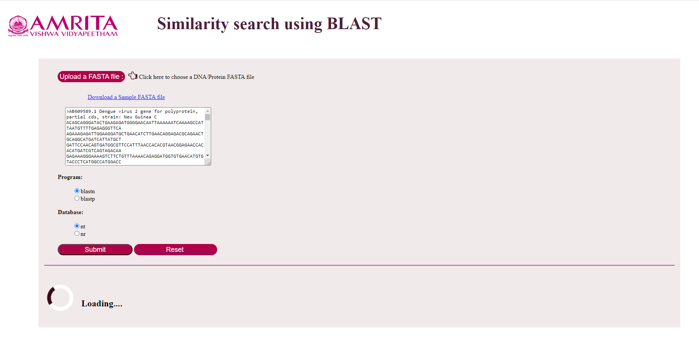

### Steps to use the simulator

1.	Open the simulator tab
 

&nbsp;

2.	Users need to upload DNA or Protein sequence in FASTA File Format. A sample FASTA file is provided in the interface. Users can download the file by clicking on “Download a Sample FASTA file” and then can upload the same file for analysis. 
 

When the user uploads the FASTA file, the sequence will be displayed in the text box of the GUI as shown. 

&nbsp;

3.	Two programs in BLAST, blastp and blastn were provided in GUI. 
blastp: query sequence and the target sequence is an amino acid database.
blastn : query sequence and target sequence  is nucleotide sequence database. 
Databases  nt is (nucleotide database) and nr is (non-redundant database).

4.	After uploading FASTA file, user can select program blastp or blastn. If blastn is selected as the program, user can select either nt or nr as database. If blastp is selected user must select nr as database. Then click on submit button to run the simulation.

 
The result will be displayed after few minutes. 

&nbsp;

Results

The result page displays accession number (for example here, AB609589.1) and description (Dengue virus 2 gene for polyprotein…) about the matched sequences in the alignment. A score that represents the highest alignment score calculated from matched nucleotides and penalties for mismatches and gaps with the given query sequence. E value represents the number of alignments expected by chance with the calculated score or better. E value close to zero indicates a significant alignment between the query sequence and nucleotide database. Maximum identity indicates the highest percentage of identity for the aligned segments to the same subject sequence.

The result also displays the alignment of the base pairs in the query sequence with the subject sequence. Expect value, identity percentage and gap percentage will get displayed as results.  

 

