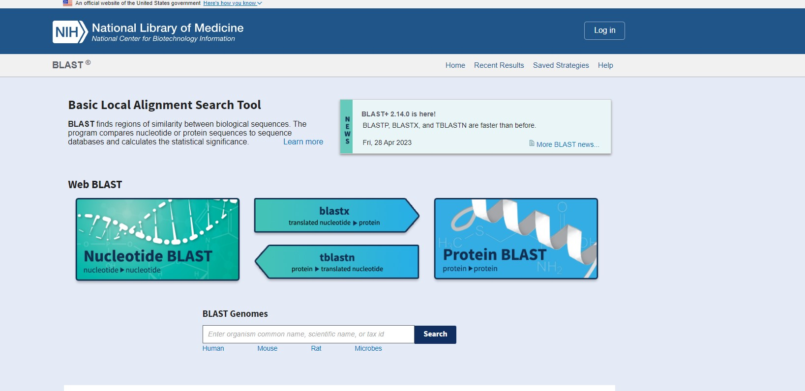

### Introduction

With the discovery of genetic code, biological research has been dwelling to understand the evolutionary relationships between various genes and proteins by analysis of the nucleotide and amino acid sequences. The aim was to infer functional and evolutionary relationships between various species thereby identifying a common ancestor. Bioinformatics, a multidisciplinary field emphasizes storing, analyzing, and interpreting biological information available in various databases using computer science and information technology. BLAST (Basic Local Alignment Search Tool), a commonly used tool in bioinformatics for sequence comparison for identifying sequence similarity that has become a fundamental tool in life science research due to its heuristic search nature, flexibility, and reliability. Sequence alignment marks as a key step in data processing in many bioinformatics and molecular biology applications.

&nbsp;

### Theory

In bioinformatics, analyzing sequence similarity is a key research topic in DNA sequence analysis as a purpose for constructing phylogenetic trees, studying gene function and for predicting protein structure. In a broader sense, comparison of nucleotide or protein sequences helps to identify function of new genetic sequences, predicting members of gene families and finally to explore evolutionary relationships. With whole genome sequencing it has been noted that with sequence similarity search, one can predict the location and function of protein-coding and transcription regulation regions of genomic DNA. As sequence alignment is important in genetic and molecular biology studies to discover biological function, gene finding, sequence divergence and sequence assembly, there exists many rapid searching tools and packages for nucleotide and protein databases for sequence analysis. The alignment finds similarities between the given sequences with the available database. The algorithms rely on dynamic programming approach that divides the problem into smaller independent sub problems and aligns the sequence more quantitatively by assigning specific scores.

Two types of sequence alignment algorithms are typically used in bioinformatics: global alignment and local alignment. Global alignment is used for comparing biological sequences of similar length for matching identical sequences. Needleman- Wunch algorithm is a general global alignment algorithm based on dynamic programming. It is generally applicable for aligning closely related sequences and homologous genes for finding polymorphisms between two sequences.

In local alignment, a subset of a sequence is attempted to align to subset of other sequences. It is generally useful for two dissimilar sequences that have a similar sequence motif in the context of a larger sequence data. The Smith-Waterman algorithm is an example of local alignment method that is also based on dynamic programming. It is suited for aligning distantly related genes for finding conserved DNA patterns. Another method is a semi global alignment approach, that is a hybrid approach of semiglobal or global methods that is best applicable with start and end of one or the other sequence data. It has been applied when the downstream of one sequence overlaps with the upstream of other sequence. 

Similarity searching and sequence comparison are widespread among biologist and there are many tools and algorithms exist in the bioinformatics field to analyze and interpret biological data including amino-acid and nucleotide sequences and protein domains and structures.  The most popular tools for finding comparison between biological sequences for finding regions of local similarity is BLAST (Basic Local Alignment Search Tool). The BLAST server at the National Center for Biotechnology Information (NCBI) has a diverse set of features that can add power to BLAST searching for research studies (Figure 1).

Figure 1. The BLAST server at the National Center for Biotechnology Information (NCBI) (http://www.ncbi.nlm.nih.gov/BLAST/)

&nbsp;

### Overview of BLAST in Bioinformatics

BLAST is a local alignment algorithm-based tool for aligning and comparing gene and protein sequences for finding similarity or dissimilarity among various species. It detects sequence similarity between a query sequence with the known sequences within a database such as NCBI or GenBank. The BLAST algorithm is relatively fast, accurate and accessible with small desktop computers and with large computer clusters. BLAST algorithms attempt to find a short fragment of a query sequence for aligning perfectly with a fragment known sequence found in a database. BLAST “query” sequences are FASTA formatted with “formatdb” program. In a BLAST alignment every letter in a sequence is paired with letters in the other sequences assigning a score to each alignment and the entire value is summed up over the length of the alignment for getting a score. BLAST uses the “blosum62” matrix (BLOcks SUbstitution Matrix) with conserved regions providing actual percentage identity values and Point Accepted Mutations (PAM) for observing the differences in closely related proteins. One PAM unit (PAM1) indicates one accepted point mutation per 100 amino acid residues, i.e., 1% change and 99% remains as such. The alignment scores are related to a statistical value called the “Expect Value, the number of times that an alignment with a given score can expect to occur at random in a database. E-values are independent of the length of the given sequence and the reliability of the matched sequences is evaluated by the obtained e-value. In blast algorithm, the whole search is done by taking the sequence of a certain word size and compares it with the database sequence and scores are assigned for each comparison. Word size is given as 11 for nucleic acids and 3 for proteins. In blast sequence alignment, gaps are introduced to account for insertions or deletions in the sequences being compared and the gap score is typically a penalty given to alignment when the sequence search has insertion or deletion. Dynamic programming algorithms use gap penalties to maximize the biological functionalities of sequence alignment. Gap penalties introduces gap open, the penalty applied when the first gap character is added to the alignment and gap extension, the penalty applied to each additional gap character that is added to an existing gap. The gap open penalty and the gap extension penalty are specified by the user and the typical values are –12 for gap opening, and –4 for gap extension. High scoring pairs (HSPs) indicate two sequences with the highest scores after sequence alignment. Specifically, longer sequences and more complex sequences generate more and longer HSPs (see also https://vlab.amrita.edu/?sub=3&brch=274&sim=1428&cnt=1) 

&nbsp;

### Types of BLAST

There are five different types of BLAST programs, and the type of BLAST search depends on the query sequence and the database search. Protein database uses the blastp and blastx programs and the nucleotide database uses the blastn, tblastn, and tblastx programs.

#### blastp: 
In blastp, the query sequence is an amino acid sequence, and the target sequence is also an amino acid database. 

#### blastx: 
Here, the query sequence is a nucleotide sequence and the target is a protein sequence or database. The nucleotide sequence is first translated to a protein sequence in its three open reading frames and compared against targeted protein sequence. 

#### blastn: 
In this program, the query sequence is a nucleotide sequence that is compared against a nucleotide sequence database that is specified by the user. It is used for studying DNA homology, mapping of oligonucleotides, finding repetitive sequence, genome annotation, and for vector identification in molecular biology studies. 

#### tblastn:
The query is an amino acid sequence and the database to be searched is a nucleotide sequence. All the six frames are translated in the database and compared with the protein sequence. It is useful for mapping protein to a genome. 

#### tblastx: 
The query is a nucleotide sequence, and the database is also nucleotide database. All six frames are translated on the query and on the database. It is useful for studying homology of distantly related species.

#### PSI-blast: 
Position-Specific Iterative BLAST program introduces a specialized scoring matrix for assigning scores to each position in the query sequence based on alignments defined by consecutive iterations of searches. It is important in genomics for detecting distant relationships between proteins of interest.

#### PHI-blast: 
Pattern-Hit Initiated BLAST employs an input sequence and a defined pattern to query a protein database. The defined pattern is in PROSITE format and helps to build a PSSM (position-specific scoring matrix) using scores of blastp. 

#### Mega Blast: 
It is an extension of the BLAST program. It uses heuristic algorithms for rapid alignment of large sequences, and entire genome of an organism for identifying similar regions from large sequence databases. In Comparative genomics it is used for identifying homologous sequences and for high-throughput sequencing of genomic data. Discontiguous Mega BLAST searches for more dissimilar sequences.

#### Blastz:  
A modified BLAST algorithm specifically designed for aligning two long genomic sequences to detect conserved non-coding sequences that function on regulatory roles in gene expression.

#### Xblast: 
It is a modified Blast search for identifying large scale genome rearrangements to identify regions of similarity for studying inversions and translocations and to identify orthologous genes and gene families.

#### Gene Blast: 
It is based on the nucleotide BLAST program that compares a query gene sequence to a database of known gene sequences to identify similar sequences. It functions to identify homologous genes, phylogenetic tree analysis and for understanding functional annotation function for studying evolution of genes across different organisms.

&nbsp;
#### Uses of BLAST program in Biological Sciences

1.	Identifying homologous genes across a diverse genome sequence.

2.	Identifying similar genes of different organisms for species comparison.

3.	comparative gene prediction for genomics and molecular biology research.

4.	Studying functional annotation of genomes for identifying functional roles and biological features of the genomes.

5.	Understanding evolutionary relationships between biological sequences.

6.	Construction of phylogenetic trees.

7.	Identifying target specific primers for polymerase chain reaction in genetics and molecular biology experimental studies.
Considering the pedagogical aspects, the experiment is important as an introductory tool for beginner level students to learn bioinformatics tools and algorithms for functional and taxonomic studies of the genome and for sequence-based data mining in future.
